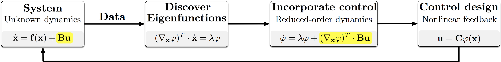
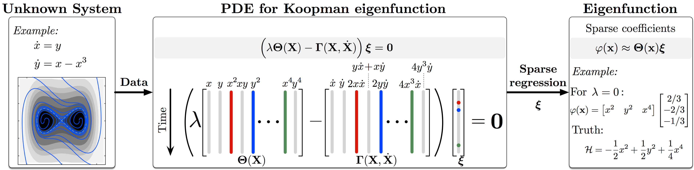
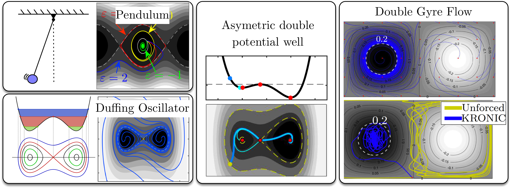

# Koopman Reduced-Order Nonlinear Identification and Control (KRONIC)
A Matlab library that implements a system identification framework for nonlinear dynamics -- referred to as Koopman Reduced-Order Nonlinear Identification and Control (KRONIC). For details see  Kaiser et. al (2017)  [[arXiv](https://arxiv.org/abs/1707.01146)].

The Koopman operator has emerged as a principled linear embedding of nonlinear dynamics, and its eigenfunctions establish intrinsic coordinates along which the dynamics behave linearly. KRONIC aims to identify Koopman eigenfunctions using sparse regression from data, and then derives the controller in these intrinsic coordinates.

Some examples on which KRONIC is demonstrated:

## Installation

1. Clone this repository to your desktop.
2. Add path to `KRONIC/utils` folder to Matlab search path using `addpath('<path to kronic>/KRONIC/utils')`.

## Dependencies
There are no dependencies.

## Getting Started

See examples in the main folder `KRONIC` for demonstrating the approach on various dynamical systems. Just execute this file in MatLab and it will generate the plot files in `KRONIC/FIGURES`.

## File description
KRONIC/

   -- `AsymmetricPotentialWell.m` : Well hopping in an asymetric potential double well
   -- `AutonomDoubleGyre.m`       : Control of drifters in a double gyre flow, a simple model for ocean mixing
   -- `NonAutonomDoubleGyre.m` 	: Similarly for the non-autonomous case
   -- `DiscoverDuffing.m`		: Discovery of Koopman eigenfunctions/conserved quantities from data
   -- `DiscoverDuffing_Convergence.m` : Convergence analysis (error, estimation, control) [data and computational efficiency]
   -- `DiscoverDuffing_KRONICvsEDMDc.m` : Comparison of KRONIC with extended dynamic mode decomposition (EDMD) for control 
   -- `SlowManifold.m` : Control of system with slow manifold (analytical example)
   -- several other examples

## License ([CiteMe OSS](https://github.com/cite-me/oss))

The code is published under the [CiteMe OSS license](https://github.com/cite-me/oss). See the [LICENSE file](LICENSE) for details.

